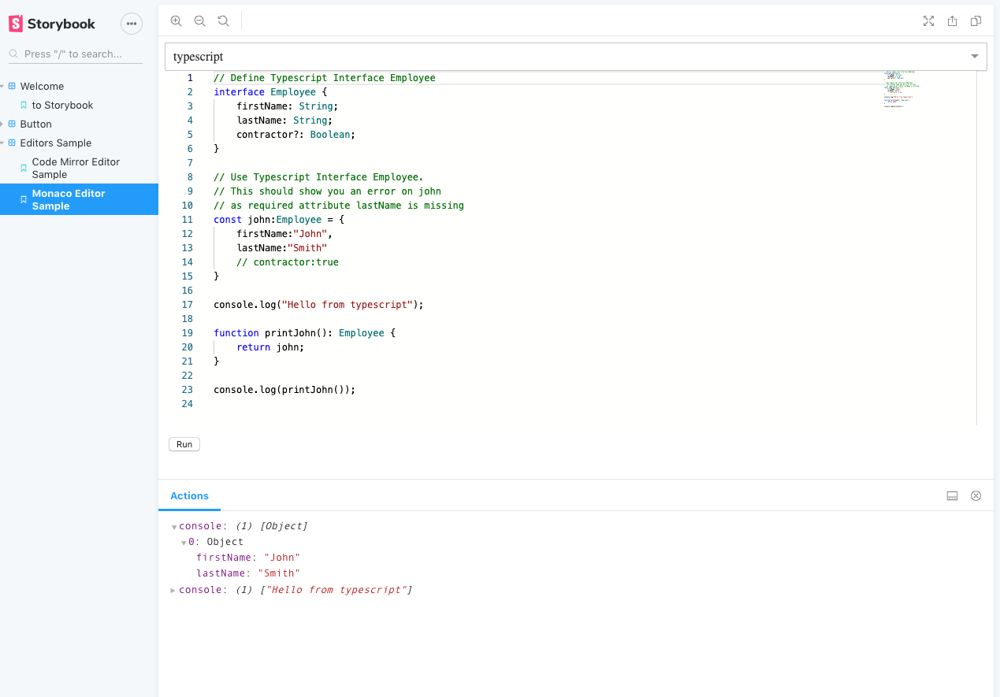

# Sample for documentation interaction

Code editor showcasing Monaco and CodeMirror editors using [storybook](https://storybook.js.org/)

Monaco:


Code mirror:


Run the app:

```
npm install
npm run storybook
```
